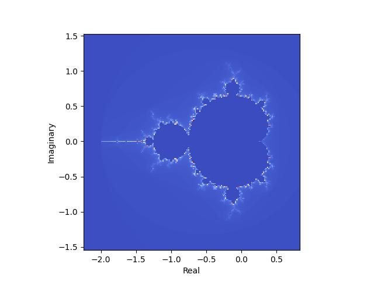
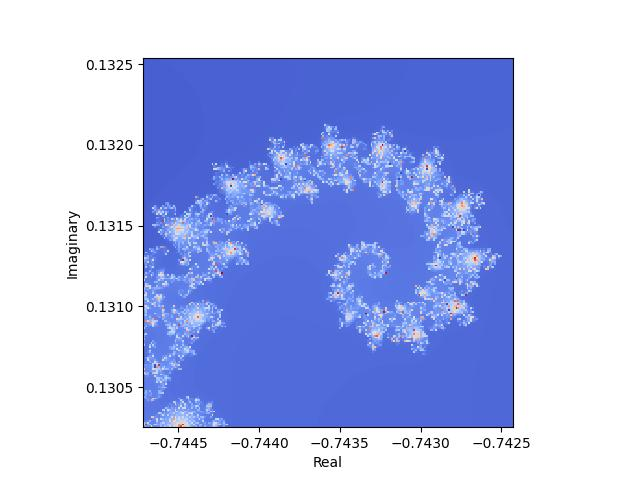
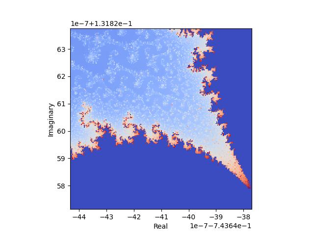

# mandelbrot
Creates images of the Mandelbrot set

### Overview
This node.js package calculates and visualizes the mandelbrot set.  The computation
is performed by the provided `mandelbrot.js` script, and the visualization is done
in python by a `mandelbrot-plotter` script.

### How to install

```
$ npm install commander
$ npm install mathjs
```

### How to run
Three examples of how to run these scripts together are provided in `example.bash`.  They can be generated by running

```
$ bash example.bash
```

to produce images like these:






